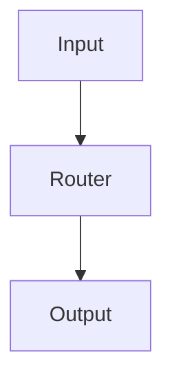
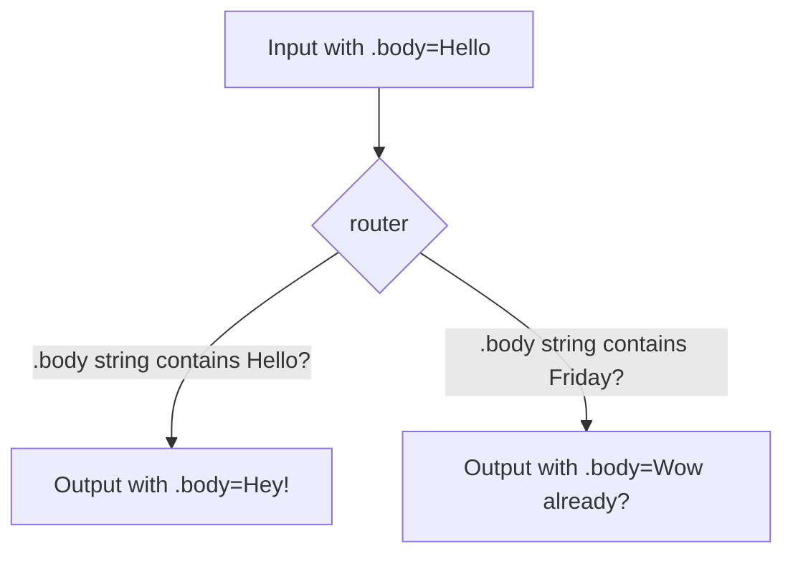

Welcome to Kanal documentation!
=============

It seems you are interested in building bots.
Bots for Telegram, Slack, Discord, Cli, etc.

Well, you came to the right place.



On this page you can get the quick starting guide and shallow introduction to the building blocks.


For more info you can check specific pages in this documentation.

Please be advised. If at some point in the future using Kanal will become as easy as just requiring number
of plugins and writing routes, it is still crucial to grasp on the concept of
how Kanal works, it can help you in the future with writing routes properly, registering actually needed plugins and knowing what could've gone wrong if error happens.




This introduction does not utilize Batteries plugin (for the sake of practice and understanding), which is available in Kanal gem for usage and already has number of basic (but often crucial) conditions and parameters


## Installation

```sh
gem install kanal
```

## Basic idea of Kanal and how it works

Kanal is just a... router. Well, router with batteries included.

When you build a bot for some messenger, or a cli, or a frontend simulation of a
messenger, you can imagine that there is some kind of `input` and after processing
`input`, you expect an `output` given in return.


E.g.: you write "Hello" (this is `input`) to bot and it responds with "Hey there!" (this is `output`)


## Getting started

For starters you need to create the core

```ruby
require "kanal"

core = Kanal::Core::Core.new
```

## Input, Output and what are the parameters of those Objects

### Input

Input is always created with the `core.create_input` method (not with instantiating object by yourself).

```ruby
require "kanal"

core = Kanal::Core::Core::new
input = core.create_input
```

### Output

Output is created inside the router of the core.

```ruby
require "kanal"

core = Kanal::Core::Core.new
input = core.create_input

output = core.router.create_output_for_input input
```

If you are are wondering why there is no any kind of text in input, or any kind of data passed with input,
please read documentation further to learn about input/output parameters.


### Parameters for input and output

So, obviously, input has to have some kind of data, yes? In our case string, like in example with "Hello".

Yes, of course. For this task Kanal has prepared the feature of registering parameters into the
input and output objects via methods in core.


Input/Output parameters in this case are not affiliated with the official programming languages term "parameter" (specified parameters for methods/function to be used as arguments at runtime).

In Kanal, input/output parameters are allowed properties of objects that can be set or get


```ruby
require "kanal"

core = Kanal::Core::Core.new

# Here we are registering parameter :body, which after that can be accessed with
# input.body = ANY_VALUE // setter
# input.body // getter
core.register_input_parameter :body

input = core.create_input
# We can write here like this because we registered this parameter for input
input.body = "Hello"

# We are getting the output using the core.router, because
# it's the router that tests input against all the configure routes - about that
# you can learn by reading documentation further
output = core.router.create_output_for_input input
```

And now for output. Pretty much the same way you can register output parameters:

```ruby
core.register_output_parameter :body
```


Why does output object need parameters? To put it simply - so in one of the routes
you can populate your output with the used parameter, by simply setting object property
like in example with input above. You will learn more about that further on this page.



Without registering parameter for input and trying to set it in input object, you will
get a runtime error telling you that you probably forgot to register that parameter.


## Conditions. What are they?

Now, about conditions.

Without them, router won't work properly.

Barebones Kanal core does not have any conditions inside, but it has
the ability for you to register them.

What are they? They are basically true/false blocks that will tell the router if this
particular route should be used.
Consider this graph:



As you can see, something checks which output should be given for specific input.

Those are conditions, and conditions can be registered within the core.

Conditions are registered within the ```condition pack``` that has specific name.

Thanks to that you can separate a number of conditions by different pack names, for example:

- contains_day_of_week
  - friday
  - tuesday
- contains_name_of_tree
  - maple
  - birch
  - oak

Now, let's register 2 conditions for checking weekday

```ruby
...

core.add_condition_pack :contains_day_of_week do
  add_condition :friday
    met? do |input, core, argument|
      # Rememer how you registered .body parameter of input? It will be accessible in condition here!
      input.body.include? "friday"
    end
  end

  add_condition :tuesday
    met? do |input, core, argument|
      input.body.include? "tuesday"
    end
  end
end
```


What is an ```argument``` and why is there is core as one of the arguments of block? You can check more about that in conditions documentation page!



Alright, we registered 1 condition pack and 2 conditions inside of it. What to do now? Now, the fun part. On to creating routes!

## Adding actual routes (the fun part)

Now, after registering input/output parameters and conditions, we can begin creating our routes.

```ruby
...

core.router.configure do
  on :contains_day_of_week :friday do
    respond do
      body "What, already?"
    end
  end

  on :contains_day_of_week :tuesday do
    respond do
      body "Start of the week huh"
    end
  end
end

```

As you can see, adding routes is pretty straight forward.

You see that `body` over there? That `body` will be set into the output object. We registered output
paremeter :body and it will be available here for usage, inside `respond` block.

`respond` accepts block of code which will be executed if router gets there after cheking in with conditions.

In respond block you can actually do anything besides setting output parameters.

You can make a database call, http request, save info into the file, anything.


The respond block actually has more features than in this example. You can access input or core there.
More about that - in the Respond block documentation page.


Ok, so we added 2 routes. By now you probably wondering about one thing...
**What happens if no route found for given input?**

## Default response, if no route found

Yes, the default response, which usually in bots looks like
"Sorry, I did not understand you. Here is the list of phrases you can use..."

```ruby
...

core.router.default_response do
  body "Oh, it seems I did not understand you. Try again?"
end
```

When Kanal can't find appropriate route with the used conditions, it would refer
to the default response. It can contain the same code as in `respond` block.


Actually Kanal requires default response to be present! Without it, your code would not start
and raise a runtime error asking you to provide default response.


## What to do next?

Ok, so now you have the core, registered parameters, conditions, routes... What's next?


If you are already in the know, you can utilize existing Kanal plugins, interfaces
to create specific bots with specifics features, conditions, database, etc.

But if you are reading this documentation first time -
for the sake of example and learning by practice consider continuing reading.


Well, actually, for the just Kanal part, this is it.

But of course you won't be able to build bots with just this! You need to somehow attach it to
some kind of bot library or something...

Well, by reading this shallow introduction you can create a simple cli bot.

## Creating a simple Cli bot (whole code example)

Here I will post the whole code you can simply copy,
paste into file app.rb and run it in your terminal.


This example is very simple and does not utilize all features of creating conditions
or respond block, please refer to the appropriate pages for more info.

(for example, you can create conditions with arguments and in routes specify which argument you expect, making the explicit conditions for each word like in this example obsolete and cumbersome)

(or for another example, you can create nested routes!)



```ruby
# app.rb
require "kanal"

core = Kanal::Core::Core.new

core.register_input_parameter :body
core.register_output_parameter :body

# Mind this one, we register output parameter that we can set in the respond block
# and utilize it later
core.register_output_parameter :should_exit

core.add_condition_pack :contains_word do
  add_condition :hello
    met? do |input, core, argument|
      input.body.include? "hello"
    end
  end

  add_condition :bye
    met? do |input, core, argument|
      input.body.include? "bye"
    end
  end
end

core.router.default_response do
  body "I did not understand you... Please try again!"
end

core.router.configure do
  on :contains :hello do
    respond do
      body "Hello to you to!"
    end
  end

  on :contains :bye do
    respond do
      body "Bye bye! Cya later!"

      should_exit true
    end
  end
end

puts "Starting bot."

program_should_stop = false

while !program_should_stop do
  puts "Please enter your message:"

  input = core.create_input
  input.body = gets.chomp

  output = core.router.create_output_for_input input

  puts "Bot response:"
  puts output.body

  # As you can see we accessing the registered parameter here in output object
  if output.should_exit == true
    program_should_stop = true
  end
end

puts "Bot stopped! Thank you for the conversation!"
```

```sh
ruby app.rb
```
